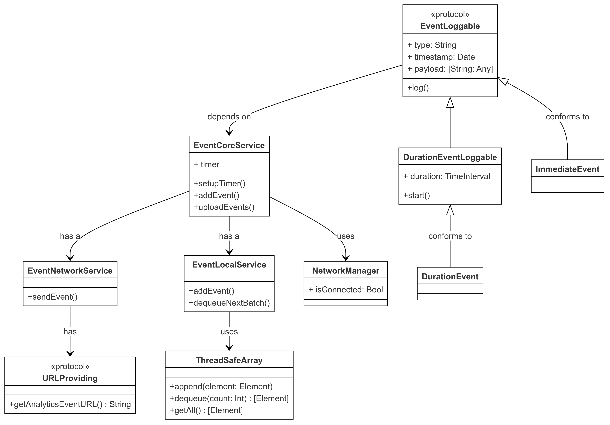
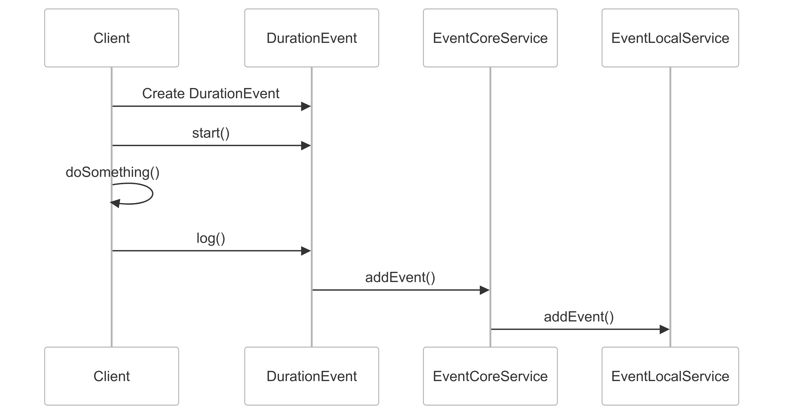
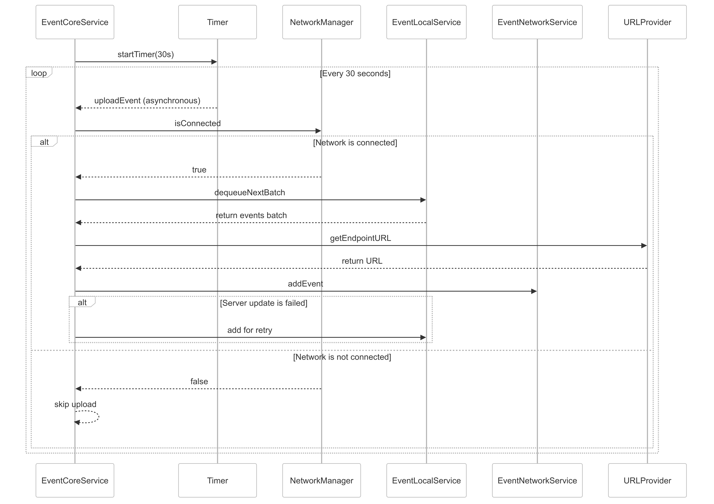

# Mission of CodeVerde Project

The mission of CodeVerde is to empower developers to build scalable, maintainable, and modular systems by bridging the gap between theoretical concepts and practical application of architectural principles and design patterns.

By providing clear examples, reusable templates, and intuitive tools, CodeVerde aims to simplify complex design challenges, foster best practices, and inspire innovation.  Our goal is to build a go-to resource that helps developers of all skill levels to craft clean,
efficient, and future-proof codebases.

Feel free to contribute or share your thoughts! Together, we can advance the art of software design and make complex systems simpler and more accessible for everyone.

**Table of Contents**

- [Mission of CodeVerde Project](#mission-of-codeverde-project)
- [Living Projects:](#living-projects)
  - [MeiAnalytics](#meianalytics)
    - [1. Features](#1-features)
    - [2. Installation](#2-installation)
    - [3. Usage](#3-usage)
      - [3.1. Importing MeiAnalytic](#31-importing-meianalytic)
      - [3.2. Basic Setup](#32-basic-setup)
      - [3.3. Tracking Events](#33-tracking-events)
    - [4. High Level Design](#4-high-level-design)
      - [4.1. Class Diagrams](#41-class-diagrams)
      - [4.2. Sequence Diagrams](#42-sequence-diagrams)
        - [4.2.1. Log event with duration](#421-log-event-with-duration)
        - [4.2.2. Upload events to server](#422-upload-events-to-server)
    - [5. Architecture and Design Patterns](#5-architecture-and-design-patterns)
      - [Design Patterns Used](#design-patterns-used)
        - [Creational](#creational)
        - [Structural](#structural)
        - [Behavioral](#behavioral)
        - [Concurrency](#concurrency)
        - [Patterns in SwiftUI](#patterns-in-swiftui)
    - [6. Framework Open Tasks](#6-framework-open-tasks)
      - [Features Improvement](#features-improvement)
        - [Analytics Framework](#analytics-framework)
      - [Technical Improvement](#technical-improvement)
  - [MeiUIKit](#meiuikit)
    - [1. Features](#1-features-1)
    - [2. Installation](#2-installation-1)
    - [3. Usage](#3-usage-1)
    - [4. Design Diagrams](#4-design-diagrams)
      - [4.1. Component and Class Diagrams](#41-component-and-class-diagrams)
      - [4.2. Sequence Diagrams](#42-sequence-diagrams-1)
    - [5. Design Patterns Used in project](#5-design-patterns-used-in-project)
    - [6. Framework Open Tasks](#6-framework-open-tasks-1)
      - [Features Improvement](#features-improvement-1)
      - [Technical Improvement](#technical-improvement-1)
- [Key Design Principles for iOS Development](#key-design-principles-for-ios-development)
  - [Popular Architecture Patterns](#popular-architecture-patterns)
    - [1. **Model-View-Controller (MVC)**](#1-model-view-controller-mvc)
    - [2. **Model-View-ViewModel (MVVM)**](#2-model-view-viewmodel-mvvm)
    - [3. **VIPER (View, Interactor, Presenter, Entity, Router)**](#3-viper-view-interactor-presenter-entity-router)
    - [4. **Clean Architecture**](#4-clean-architecture)
    - [5. **Model-View-Presenter (MVP)**](#5-model-view-presenter-mvp)
    - [6. **Coordinator Pattern**](#6-coordinator-pattern)
    - [7. **Compositional Architecture**](#7-compositional-architecture)
    - [8. **SwiftUI with Declarative Architecture**](#8-swiftui-with-declarative-architecture)
    - [9. **Reactive Programming**](#9-reactive-programming)
    - [Choosing the Right Pattern:](#choosing-the-right-pattern)
  - [SOLID Design Principles](#solid-design-principles)
  - [Design Patterns](#design-patterns)
        - [**Creational**](#creational-1)
          - [**Singleton**](#singleton)
          - [**Prototype**](#prototype)
        - [Structural](#structural-1)
          - [**Dependency Injection**](#dependency-injection)
          - [**Facade**](#facade)
        - [Behavioral](#behavioral-1)
        - [Concurrency](#concurrency-1)
  - [Anti-Patterns](#anti-patterns)
- [CodeVerde Project Roadmap](#codeverde-project-roadmap)
- [Reference](#reference)
  - [Tools Used in the Project](#tools-used-in-the-project)
    - [IDEs](#ides)
    - [Design and UML Modeling Tools](#design-and-uml-modeling-tools)
    - [Repositories](#repositories)

# Living Projects:

## MeiAnalytics

**MeiAnalytics** is a lightweight and flexible analytics framework for tracking user interactions, 
events, and custom metrics in iOS applications. 

### 1. Features

- **Event Tracking**: Track custom events and user interactions with ease.
- **Session Management**: Measure the duration of sessions, screen views, and actions.
- **Configurable Logging**: Dynamically enable or disable logging as needed.
- **High Performance**: Process and send events to the server in background process.
- **Reliability**: Unprocessed events are persisted locally to prevent data loss.

### 2. Installation

To integrate MeiAnalytics with Swift Package Manager:

2.1. In Xcode, Add 'MeiAnalytics' project to your workspace
2.2. Under your application project **General > Frameworks, Libraries, and Embedded Content**. 
2.3. Add MeiAnalytics.framework.

### 3. Usage

#### 3.1. Importing MeiAnalytic

Import MeiAnalytics in your Swift files:

```swift
import MeiAnalytics
```

#### 3.2. Basic Setup

Enable Tracking if needed:

```swift

MeiAnalytics.shared.isEnabled = true

```

#### 3.3. Tracking Events

All analytics events are associated with a custom event type and optionally some additional properties. When an event's log method is called, its timestamp and duration are recorded, creating a snapshot for further background processing. The framework will periodically send events to the server when the device is connected to the network. Any unprocessed events are saved in NSUserDefaults to preserve data in case the app restarts.

The framework supports the following two types of events:

* ImmediateEvent - an event occurs instantly and is recorded at a single point in time.
* DurationEvent - an event with a measurable duration, tracking both a start and end time.

```swift

enum SearchEvent: String {
    case searchInputFieldKeyPressed
    case searchViewInteraction
}

let searchInputFieldKeyPressedEvent = ImmediateEvent(type:SearchEvent.searchViewInteraction.rawValue)

searchInputFieldKeyPressedEvent.log()

let searchViewInteractionEvent = DurationEvent(type:SearchEvent.searchViewInteraction.rawValue)
searchViewInteractionEvent.start()
// do other stuff ...

searchViewInteractionEvent.log()

```

### 4. High Level Design

#### 4.1. Class Diagrams



#### 4.2. Sequence Diagrams

##### 4.2.1. Log event with duration


Sequence-Log_DurationEvent

##### 4.2.2. Upload events to server



### 5. Architecture and Design Patterns

####  Design Patterns Used 

##### Creational 

- [Singleton](#singleton): Ensures a class has only one instance and provides a global access point to it.
  - Example: [AnalyticsService.shared](MeiAnalytics/MeiAnalytics/Sources/CoreService/AnalyticsService.swift) 
  - Purpose: To provide a single, centralized access point for clients, ensuring a consistent and simple access to the service from all layers.
  - This was used in conjunction with [Dependency Injection](#dependency-injection) to allow clients to manage its dependencies.

- [Prototype](#prototype): Create objects by copying existing objects. 
  - Example: [EventLoggable.deepCopy](MeiAnalytics/MeiAnalytics/Sources/ModelEvents/EventLoggables.swift) using JSON encoding/decoding.

##### Structural 

- [Dependency Injection](#dependency-injection)
  - Example: [AnalyticsService.context](MeiAnalytics/MeiAnalytics/Sources/CoreService/AnalyticsService.swift) 
  - Purpose: This allow unit test to create instance with depedencies configured for unit test by calling `instanceForTesting'. 
- [Facade](#facade)
   - Example: [AnalyticsService](MeiAnalytics/MeiAnalytics/Sources/CoreService/AnalyticsService.swift) 
   - Purpose: Provides a simplier interface while reducing coupling between the client and the internal components.

##### Behavioral

- *Strategy*

##### Concurrency 

- *Reader-Writer Lock*

##### Patterns in SwiftUI

- *Declaratie UI Programming*

- *Functional Reactive Programming*

- *State-Driven*

- *Unidirectional Data Flow*

- *MVVM*

### 6. Framework Open Tasks

#### Features Improvement

##### Analytics Framework

1. Framework Configuration by client
    - 1.1 Server Endpoints
    - 1.2 Payload transformation

2. Local Logging
    - 2.1 log to console
    - 2.2 log to file
    - 2.3 Export 
    - 2.4 Report with charts

#### Technical Improvement

1. Move dependances to Context objects
2. Add Unit tests
3. Add UI automation tests.

## MeiUIKit

**MeiUIKit** aims to tackle scalability and UI fragmentation challenges.  It offers a collection of generic and configurable UI components designed to streamline and unify the UI elements across a system.  

### 1. Features

- **Content Navigations**: Enables clients to organize and present data in a tree-like structure.
  - Video Scrubber
  - Book Style Navigation

### 2. Installation

### 3. Usage

### 4. Design Diagrams

#### 4.1. Component and Class Diagrams

#### 4.2. Sequence Diagrams

### 5. Design Patterns Used in project

### 6. Framework Open Tasks

#### Features Improvement

#### Technical Improvement


# Key Design Principles for iOS Development

## Popular Architecture Patterns 

Here are some of the most popular software architecture patterns:

### 1. **Model-View-Controller (MVC)**
- **Description**: MVC is fundamental in Cocoa development, as it separates the app into three distinct roles: 
  - **Model**: Encapsulate app-specific data and define the business logic, including the processes for manipulating and managing that data.
  - **View**: Handle the visual representation and user interactions.  
  - **Controller**: Acts as the intermediary between the Model and View, interpreting user actions from the View and updating the Model accordingly.
- **Use Cases**: The foundation of many iOS frameworks such as UIKit.
- **Main Advantages**:
  - Simple to understand and implement.
  - Easy to integrate with other iOS frameworks.
  - Support parallel development as its modular approach allows clear task delegation
- **Main Challenges**:
  - Controllers can become overly complex (Massive View Controllers), leading to scalability limitations.
  - Lack of a clear standard implementation, resulting in inconsistencies.
  - Synchronizing the Model and View through the Controller can require considerable effort.
- **Key Historical Milestones**:
    - Origin: The concept was formulated by Trygve Reenskaug in 1970s at Xerox PARC.
    - Formal Introduction: Officially introduced in the early 1980s during the development of Smalltalk-80.
    - Adoption: Widely implemented in various frameworks and platforms, including: 
      - Cocoa and Cocoa Touch frameworks by Apple.
      - Ruby on Rails for web development.
      - ASP.NET MVC for .NET applications.
- **Reference**: [developer.apple.com](https://developer.apple.com/library/archive/documentation/General/Conceptual/DevPedia-CocoaCore/MVC.html) 

### 2. **Model-View-ViewModel (MVVM)**
- **Description**: Adds a **ViewModel** layer to mediate between the View and Model, handling data transformation and state management:
  - **Model**: Represents the app's data and encapsulates the business logic.
  - **View**: Represents the UI and is responsible for presenting data to the user.
  - **ViewModel**: Retrieves data from the Model, processes it for display in the View, handles user inputs from the View, updates the Model as needed, and manages the state of the App.
- **Use Cases**: Apps with complex UI bindings, often used with SwiftUI or RxSwift.
- **Main Advantages**:
    - Enhanced testability as the ViewModel is independent of the UI framework, making unit testing easier.
    - Improves code reusability since viewModels can be reused across multiple Views and platforms.
    - Seamless integration with declarative UI frameworks like SwiftUI and React.
- **Main Challenges**:
  - Additional abstraction layers can introduce performance penalties, affecting app responsiveness.
  - ViewModels can become bloated when too much logic is placed in them.
  - Platforms like iOS lack official MVVM frameworks, leading to potential inconsistencies in implementations.
- **Key Historical Milestones**:
    - Origin: Introduced by John Gossman in 2005 while working on Microsoft’s WPF framework.
    - Adoption: Widely used with modern declarative UI frameworks: 
      - React
      - SwiftUI
      - Jetpack Compose (Android)
- **Reference**: Apple doesn't provide an official reference for MVVM; however, it is widely used in the developer community due to its reactive and declarative nature.

### 3. **VIPER (View, Interactor, Presenter, Entity, Router)**
- **Description**: A strict architecture pattern that divides the app into five distinct components:
  - **View**: Displays User Interface.
  - **Interactor**: Handles business logic.
  - **Presenter**: Connects View and Interactor.
  - **Entity**: Manages data models.
  - **Router**: Manages navigation.
- **Use Cases**: Large, scalable projects requiring clear separation of concerns.
  
- **Top 3 Advantages**:
  - Highly Modular and Testable: Each component is isolated, facilitating easier testing and independent development.
  - Improved Code Maintainability: Clear separation of responsibilities ensures organized and maintainable code.
  - Enhanced Scalability: New features can be added and the app scaled without disrupting the existing codebase.
  
- **Top 3 Challenges**:
  - Overhead for Simple Apps: The pattern can feel excessive and unnecessarily complex for small or straightforward applications.
  - Significant Boilerplate Code: Requires writing a lot of repetitive code to set up and maintain the structure.
  - Steep Learning Curve: Developers new to VIPER may find it challenging to understand and implement due to its strict separation of components.

- **Key Historical Milestones**:
  - 2013-2014: Introduced by developers at Mutual Mobile as a practical adaptation of Clean Architecture by Robert C. Martin.
  - 2014-2016: Gained traction in companies like Uber as its structured approach became popular among teams managing complex codebases.
  - 2018-2020: Enhanced to integrate with reactive programming tools like RxSwift and Combine for improved data flow and state management.
  - 2020-Present: Adapted to coexist with SwiftUI, focusing on business logic and navigation while leveraging SwiftUI for declarative UI composition.
  - 
- **Reference**:
  - [Architecting iOS Apps with VIPER at objc.io](https://www.objc.io/issues/13-architecture/viper)
  - [The Book of VIPER](https://github.com/strongself/The-Book-of-VIPER)
  - [Getting Started with the VIPER Architecture Pattern](https://www.kodeco.com/8440907-getting-started-with-the-viper-architecture-pattern)

### 4. **Clean Architecture**

### 5. **Model-View-Presenter (MVP)**

### 6. **Coordinator Pattern**

### 7. **Compositional Architecture**

### 8. **SwiftUI with Declarative Architecture**

### 9. **Reactive Programming**  

### Choosing the Right Pattern:

Each pattern has trade-offs, so the choice depends on your app's complexity, team familiarity, and long-term goals.

- **Small/Medium Apps**: MVC, MVVM.
- **Complex Navigation**: MVVM + Coordinator.
- **Large-Scale Apps**: VIPER, Clean Architecture.
- **State-Driven Apps**: Redux, SwiftUI with Combine.
- **Reactive UIs**: MVVM + RxSwift or Combine.

## SOLID Design Principles

## [Design Patterns](https://en.wikipedia.org/wiki/Software_design_pattern)

Design patterns make development faster by providing tried-and-true solutions to common programming problems. Good software design means thinking ahead about issues that might not show up right away during implementation. Fresh code can sometimes have hidden bugs or quirks that take a while to spot and could cause bigger problems later on. Using design patterns can help avoid these pitfalls and make the code easier to read and maintain.

##### **Creational** 

Creational design patterns deal with object creation mechanisms, aiming to create objects in a way that is suitable for the situation. These patterns provide flexibility and enhance the reusability of code by abstracting the instantiation process. They help make the system independent of how its objects are created, composed, and represented.

**Key Objectives**
- Encapsulation of Object Creation: Hides the logic of object creation from the client.
- Flexible Instantiation: Enables multiple ways to create objects without modifying client code.
- Enhanced Reusability: Ensures consistent and reusable object creation processes.

###### **Singleton**

The Singleton design pattern ensures that a class has only one instance and provides a global access point to it. This pattern is commonly used when a single object is required to coordinate actions across the system, such as managing shared resources or a common configurations.

**Key Characteristics**
- Single Instance: Guarantees that only one instance of the class is created throughout the app lifecycle..
- Global Access Point: Provides a way to access the instance from anywhere.
- Lazy Initialization: The instance is created only when first accessed.

**Advantages**
- Simplifies management of shared resources by controlling access to the sole instance.
- Reduces memory overhead by reusing the same instance.

**Disadvantages**
- Global state can make testing and debugging more difficult.
- Tight coupling to the Singleton can complicate dependencies which lead to reduce flexibility.
- Violates the principle of dependency injection by hiding dependencies.

**How It Fits in the Category**
- Core Intent: Ensures controlled creation of an object, guaranteeing a single instance.
- Encapsulation: Encapsulates object creation logic within the class, hiding it from external code.

**iOS System Use Cases**
- NSNotificationCenter.default
- URLSession.shared 
- UserDefaults.standard.

**Code Template**
```swift
final public class AnalyticsService {
    public static let shared = AnalyticsService()
    private init() {
    }
}
```

**Usage**
```swift
  let eventService = AnalyticsService.shared
```

###### **Prototype**

##### Structural 

###### **Dependency Injection**

###### **Facade**


##### Behavioral

- *Strategy*

##### Concurrency 

- *Reader-Writer Lock*
## Anti-Patterns

# CodeVerde Project Roadmap
- Refine Living projects
- Add details for design patterns 
- Link design patterns to code in projects
- Add a SwiftUI framework

# Reference
## Tools Used in the Project
### IDEs
  - Xcode
  - Visual Studio Code
  - Markdown All in One

### Design and UML Modeling Tools
  - [Mermaid Chart](https://www.mermaidchart.com/)

### Repositories 
  - Github
  - Git Large File Storage ([LFS](https://git-lfs.com/))